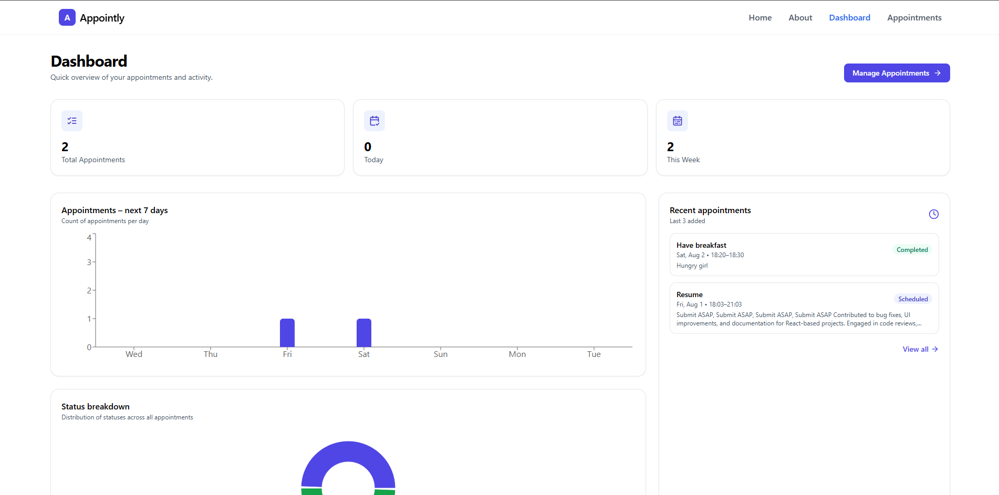
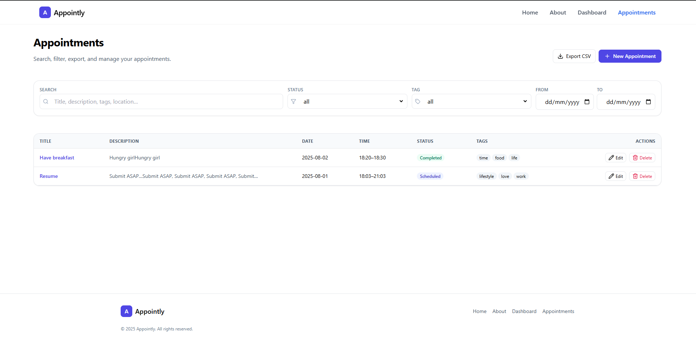
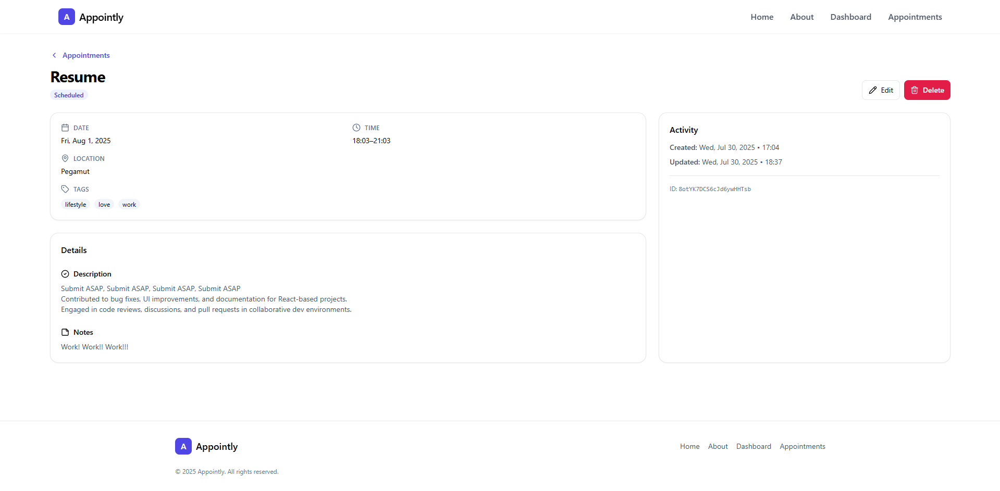

# **Appointly**

A simple and modern appointment manager built with React and Tailwind CSS for users to **track, organize, and manage appointments** with ease.
It includes a responsive UI, quick CRUD modals, filtering & search, and a clean dashboard with charts.

## ✨ Overview

Appointly is a simple yet powerful appointment manager designed for individuals and small teams who need a fast, clean way to stay organized.
It was built with React (Vite) and Tailwind CSS, focusing on speed, clarity, and great user experience.

With Appointly, you can:

- Track and organize all your appointments in one place.
- Quickly add, edit, or remove appointments with responsive CRUD modals.
- Search and filter appointments by date, status, or tags so you never miss a detail.
- Categorize with tags to keep things flexible and tailored to your needs.
- Get a visual overview of your schedule with charts and dashboard insights.

The entire UI is fully responsive, so it works beautifully on mobile, tablet, and desktop screens.
All data is saved locally, so you can close and reopen the app without losing your appointments.
Appointly is perfect for solo professionals, freelancers, and small business owners who need a lightweight, no‑signup solution to stay on top of their schedule.

---

## 🖼️ Features

* **Landing pages:**

  * Home (Hero, Features, How it Works, CTA)
  * About (Mission, Why Appointly, FAQ)
* **Dashboard:**

  * Overview cards for total & recent appointments
  * Visual charts (appointments by status)
* **Appointments management:**

  * List view with search, filter, and CSV export
  * Create, edit, and delete modals
  * Appointment details page
  * Tags support for flexible categorization
* **Responsive:** Mobile‑first design with a mobile nav menu
* **Local data persistence:** State is saved to LocalStorage

---

## 🛠️ Tech Stack

* [**React**](https://react.dev/) (Vite)
* [**Tailwind CSS**](https://tailwindcss.com/)
* [**Redux Toolkit**](https://redux-toolkit.js.org/) (for state management)
* [**Lucide React**](https://lucide.dev/) (icons)
* LocalStorage (persistence)

---

## 📂 Project Structure

```
src/
├── components/        # Reusable UI components (Header, Footer, Modal, etc.)
├── redux/          # Appointments-related slices & forms
├── pages/             # Home, About, Dashboard, Appointments, Details
├── app/               # Redux store & slices
└── styles/            # Tailwind and global styles
```

---

## 🚀 Getting Started

### 1. Clone the repo

```bash
git clone https://github.com/Dev-Rodiyat/Appointly.git
cd Appointly
```

### 2. Install dependencies

```bash
npm install
```

### 3. Run the dev server

```bash
npm run dev
```

Open **[http://localhost:5173](http://localhost:5173)** in your browser.

---

## 💡 Usage

1. Open the app and create your first appointment from the **Appointments** page.
2. Add title, date, time, optional location and tags.
3. Manage appointments from the dashboard: edit, delete, filter, and export as CSV.
4. Tags and search make it easy to group and find appointments.

---

## 📸 Screenshots




---

## 🏗️ Future Improvements

* User authentication & cloud persistence
* Recurring appointments
* Calendar view
* Notifications & reminders
